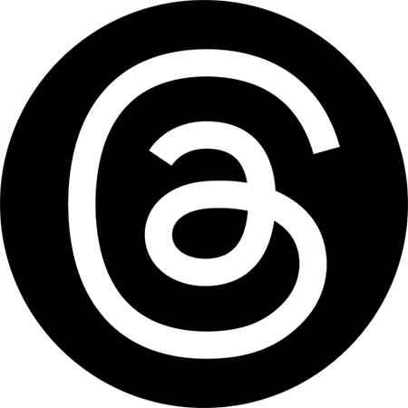

<p align="center">
    
</p>

<h1 align="center">
    Please contact me
</h1>

<p align="center">
  <a href="https://www.facebook.com/KerkEnIt/" title="Follow me on Facebook"></a>
  <a href="https://www.instagram.com/kerk.en.it/" title="Follow me on Instagram"></a>
  <a href="https://threads.net/@kerk.en.it" title="Follow me on Threads"></a>
  <a href="https://twitter.com/kerkenit" title="Follow me on Twitter"></a>
  <a href="https://www.youtube.com/@kerkenit" title="Follow me on YouTube"></a>
  <a href="https://www.linkedin.com/company/kerk-en-it/" title="Follow me on LinkedIn"></a>
  <a href="https://www.kerkenit.nl/" title="Visit my website"></a>
</p>

---

<h2> 👨🏻‍💻 &nbsp;A Little Bit About Me and My Interests</h2>

```yaml
name: Marco van ’t Klooster
located_in: Roermond, The Netherlands
current_job: Self employed
company: Kerk en IT

fields_of_interests:
  [
    "Roman Catholic Church",
    "Panama",
    "Web Development",
    "App development",
    "Home Automation",
    "Apple",
  ]
technical_background:
  [
    "Full Stack Developer"
    "Intern - App Development",
    "Intern - Apple Hardware reperation",
    "Intern - PC Construction",
  ]
  
currently_learning:
  [
    "Angualar",
    "LLM models"
  ]
hobbies:
  [
    "Photographing",
    "Photo and Video editing",
    "Blogging"
  ]
```

---

<h2> 🌅 &nbsp; Some of My Everyday Habits</h2>

```php
<?php
$month = date('m');
$day = date('d');
$day_of_week = date('w');
$activity = array('⛪️', '🙏🏽', '📿');
if ($month >= 1 && $month <= 3) :
	$activity[] = '✈️';
	$activity[] = '🇵🇦';
	$activity[] = '✍🏽';
	$activity[] = '📷';
	$activity[] = '🏊🏼';
	$activity[] = '🏖️';
	$activity[] = '🥵';
	$activity[] = '😎';
else :
	$activity[] = '👨🏻‍💻';
	$activity[] = '💭';
	$activity[] = '📱';
	$activity[] = '❤️‍🔥';
	if (rand(1, 31) == $day) :
		$activity[] = '✍🏽';
		$activity[] = '📷';
	endif;
	if ($day_of_week == rand(1, 3)) :
		$activity[] = '🏊🏼';
	endif;
	if ($day_of_week == 5) :
		$activity[] = '📚';
		$activity[] = '📿';
	endif;
endif;
printf('Today I had %1$d joyful activities which consist of %2$s', count($activity), implode(', ', $activity));
?>
```
  
---  
<h2> 💭 &nbsp;The Languages I Dream Of</h2>
<p align="left">
    
    
    
    
    
    
    
    
    
    
    
    
    
</p>
  
---  
<h2> 🚀 &nbsp;Some Tools I Have Used and Learned</h2>
<p align="left">
    
    
    
    
    
    
    
    
    
    
    
    
    
    
    
    
    
    
    
    
    
    
    
</p>

<p align="center">
    
</p>
